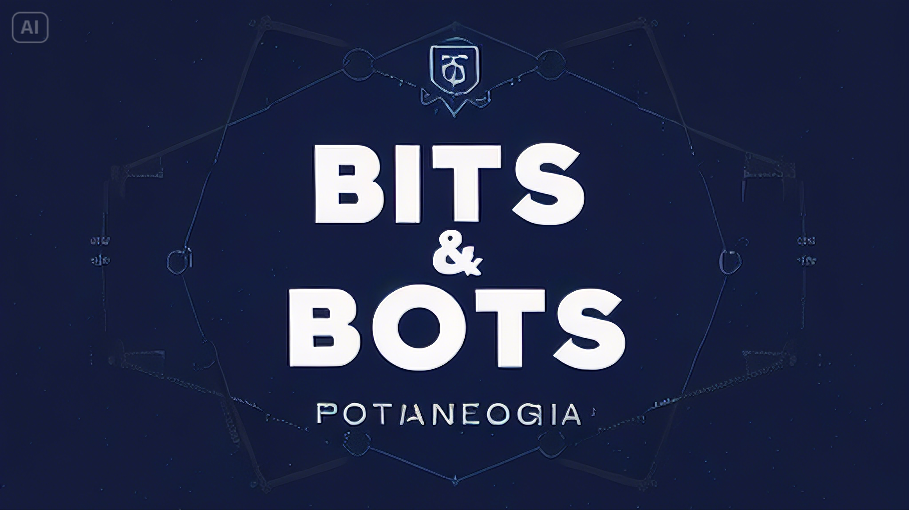
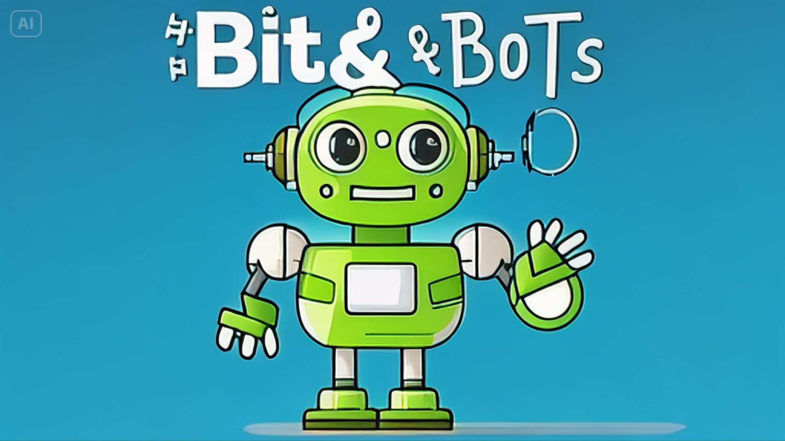

# Prompt-para-podcast-gerado_por_ia

	Prompts for Chatgpt, Dreamina and ElevenLabs to create a AI Podcast

<video  src="assets/CapaPodCast_v3.mp4" controls title ="Video de Abertura do PodCast">
    /></video>

<b>   

    preview do podcast

</b>

    <audio src="output/Podcast_Bits_Bots_LLM_Editado.MP3" controls title="Podcast editado"></audio>

# Projeto Podcast Gerado por I.A.s

 > ℹ️ **NOTE:** Este é o repositório desenvolvido para um treinamento da DIO, para o BootCamp 2024 Santander Fundamentos IA, que te o objetivo de atingir o objetivo passado durante o treinamento. [DIO](https://dio.me)

Projeto tem como objetivo gerar um podcast utilizando ferramentas de IA através de prompts mais trabalhado.

Utilizer uma esteira de prompts para gerar cada etapa do processo criativo.

## 💻 Tecnologias utilizadas no projeto

- [ChatGPT](https://chat.openai.com/) 
- [Dreamina](https://dreamina.capcut.com/)
- [ElevenLabs](https://beta.elevenlabs.io/)
- [Capcut](https://www.capcut.com/pt-br/)

## ✨ Como foi feito ?

- Roteiro gerado via chatgpt
- Audio gerado pela elevenLabs
- Dreamina Para gerar capas
- Capcut para tratar aúdio e adicionar sons de fundo

## 🛠️ Instruções de execução

Utilize os prompts dentro dos sites definidos abaixo, com os conteúdos na pasta prompt_src

-  Use os prompts de roteiro no [`chagpt`](output/chatGpt.md)
-  Use os prompts de artes no [`dreamina`](output/dreamina.md)

---

por [Álvaro Monteiro](https://github.com/Alvaro-MSJR)